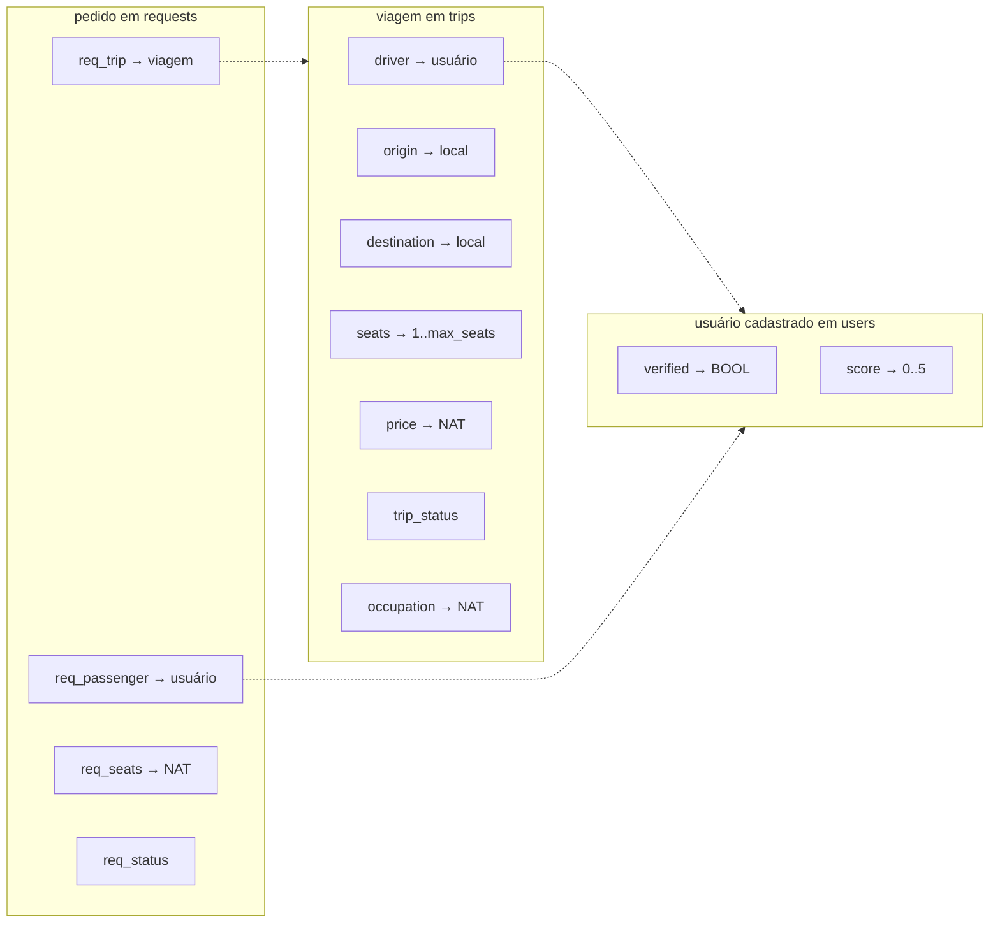
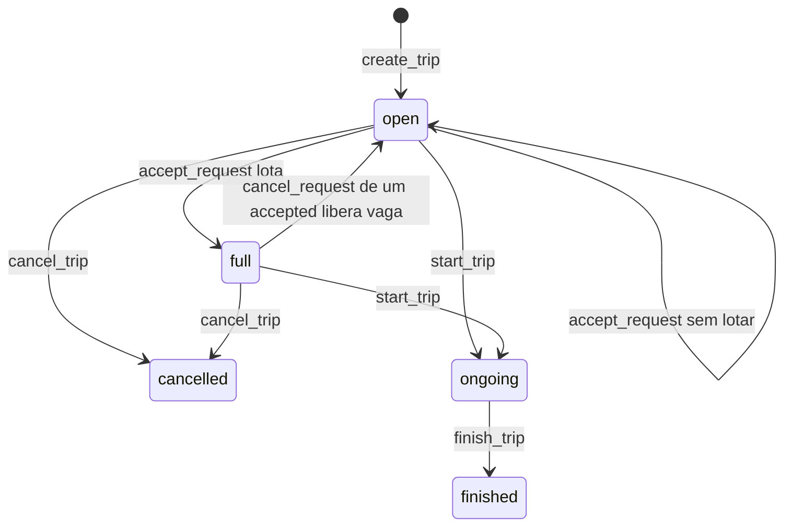
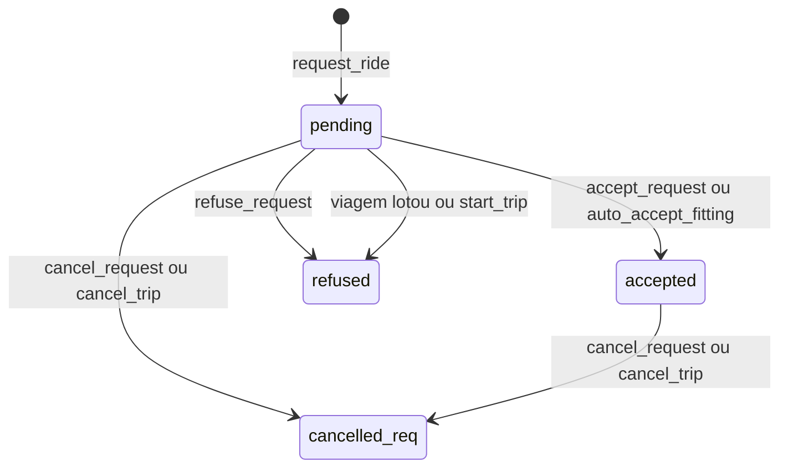
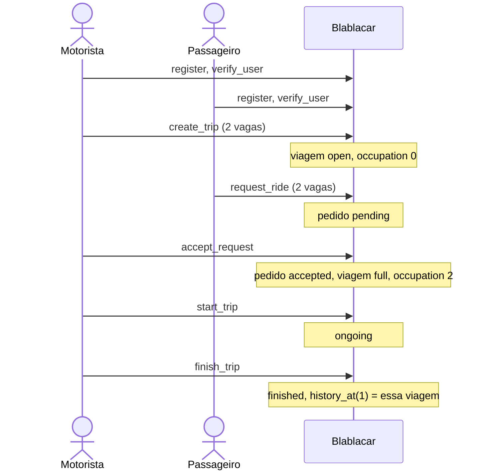

# Visão do modelo — primeira entrega

Desenho da máquina abstrata completa (README §§1–9). O [`Blablacar.mch`](../Blablacar.mch) de hoje só tem o trecho de usuários e `create_trip`, ainda com `skip`. Os desenhos abaixo são o alvo dessa primeira entrega, como está fatiado em [`docs/entregas`](entregas/).

Cada seta com nome de operação é uma chamada da máquina. Consultas (`remaining_seats`, `is_verified`, …) só leem; não aparecem nas transições.

## 1. O que existe no estado

Três “fichas”. A seta é uma função do B: a ficha da esquerda é a chave, a da direita é o valor guardado. `occupation` não aponta para pedidos; é o contador de vagas já reservadas, e tem de bater com a soma das vagas dos pedidos `accepted` daquela viagem.

As linhas pontilhadas seguem a mesma regra chave→valor: `driver` e `req_passenger` valem um usuário; `req_trip` vale uma viagem.

O histórico não é uma quarta ficha solta: é a lista ordenada das viagens que já estão `finished` (`history_len` e `history_at(i)`).

## 2. Status da viagem

`create_trip` faz a viagem nascer `open`. Aceitar não muda o status enquanto ainda sobrar vaga. Quando a ocupação fica igual à capacidade, ela passa a `full` e os outros pedidos `pending` dessa viagem vão para `refused`.

`start_trip` só sai de `open` ou `full` se já houver pelo menos 1 vaga ocupada. `cancel_trip` não existe a partir de `ongoing` nem de `finished`.

## 3. Status do pedido

O pedido nasce `pending`. `accepted` continua `accepted` depois que a viagem inicia e quando ela termina: o passageiro não “sai” do pedido ao concluir. `ongoing`, `finished` e `cancelled` é que não podem ter `pending`.

`request_ride` só em viagem `open`, com passageiro verificado, nota ≥ `min_score`, que não seja o motorista, sem outro pedido `pending` ou `accepted` na mesma viagem, e pedindo no máximo a capacidade da viagem.

## 4. Caminho da apresentação

Um cenário só, na ordem em que vale animar no ProB. Dois usuários, uma viagem de 2 vagas, o passageiro pede as 2, o aceite lota, a viagem anda e entra no histórico.

